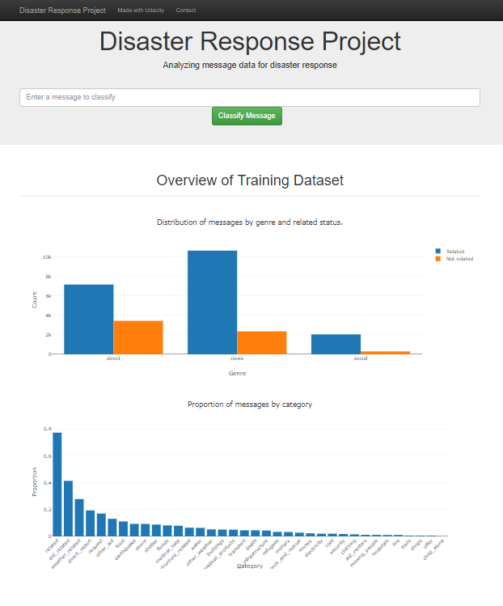

# Disaster Response Pipeline Project

In this Web App you can use a machine learning model to predict categories of messages based on tweets. Look the picture below.

### Files

app/run.py

> Run Python Flask web application.

data/process_data.py

> It's has functions that can be load, clean and save the database.

models/train_classifier.py

> It's has functions that can be build, evaluate and save the model.

### Instructions:

1. Run the following commands in the project's root directory to set up your database and model.

- To run ETL pipeline that cleans data and stores in database

> `python data/process_data.py data/disaster_messages.csv data/disaster_categories.csv data/DisasterResponse.db`

- To run ML pipeline that trains classifier and saves

> `python models/train_classifier.py data/DisasterResponse.db models/classifier.pkl`

2. Run the following command in the app's directory to run your web app.

> `python app/run.py`

3. Go to http://0.0.0.0:3001/
